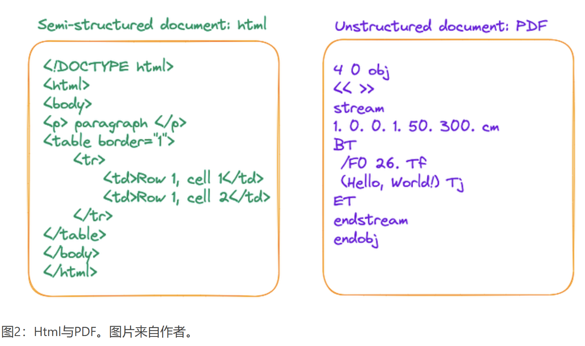

# 1、marker解析
https://github.com/VikParuchuri/marker 

marker 的原理是利于深度学习模型，检测页面布局，阅读顺序，然后格式化文本块并且对完整的文本再进行处理。这里说一下 marker 的特点：

该工具支持广泛的文档类型，特别针对书籍和科学论文进行了优化，对于复杂的公式提供了更好的支持。同时，它支持多种语言的转换，确保在全球范围内的用户都能够轻松使用

可以删除页眉、页脚以及其他页面元素。

能够格式化表格和代码块，保持排版整齐。

可以提取并保存 PDF 中的图

**参考: https://luxiangdong.com/2024/02/22/advrag2/**

# 2、解析PDF的挑战
PDF文档是非结构化文档的代表，但是从PDF文档中提取信息是一个具有挑战性的过程。与其说PDF是一种数据格式，不如将其描述为打印指令的集合更为准确。PDF文件由一系列指令组成，这些指令指示PDF阅读器或打印机在屏幕或纸张上显示符号的位置和方式。这

**解析PDF文档的挑战在于准确地提取整个页面的布局，并将内容(包括表格、标题、段落和图像)翻译成文档的文本表示形式。该过程涉及处理文本提取、图像识别和表中行-列关系的混淆中的不准确性**

# 2、如何解析PDF

1、基于规则的方法：根据文件的组织特征确定每个部分的风格和内容，但是这种方式不是很通用，因为PDF有许多类型和布局，不可能用预定义的规则覆盖他们

2、基于深度学习模型的方法：结合物体检测 和 OCR模型的解决方案

3、基于多模态大模型传递复杂结构或提取PDF中的关键信息

## 2.1、基于规则

最具代表性的工具之一是pypdf，它是一种广泛使用的基于规则的解析器。它是Langchain和LlamaIndex中解析PDF文件的标准方法

基于PyPDF检测的结果，观察到它将PDF中的字符序列序列化为单个长序列，而不保留结构信息。换句话说，它将文档的每行视为由换行字符“\n”分隔的序列，这妨碍了对段落或表格的准确识别。

这种限制是基于规则的方法的固有特征。

## 2.2、基于深度学习模型的方法

这种方法的优点是它能够准确地识别整个文档的布局，包括表格和段落。它甚至可以理解表中的结构。这意味着它可以将文档划分为定义良好的完整信息单元，同时保留预期的含义和结构。

然而，也有一些限制。目标检测和OCR阶段可能很耗时。因此，建议使用GPU或其他加速设备，并使用多个进程和线程进行处理

## 2.3、基于多模态大模型在pdf中传递复杂结构
* 检索相关图像(PDF页)，并将其发送给GPT4-V，以回应查询。
* 将每个PDF页面视为图像，让GPT4-V对每个页面进行图像推理。为图像推理建立文本矢量存储索引。根据图像推理向量库查询答案。
* 使用表转换器从检索到的图像中裁剪表信息，然后将这些裁剪后的图像发送到GPT4-V进行查询响应。
* 对裁剪的表格图像应用OCR，并将数据发送到GPT4/ GPT-3.5来回答查询

