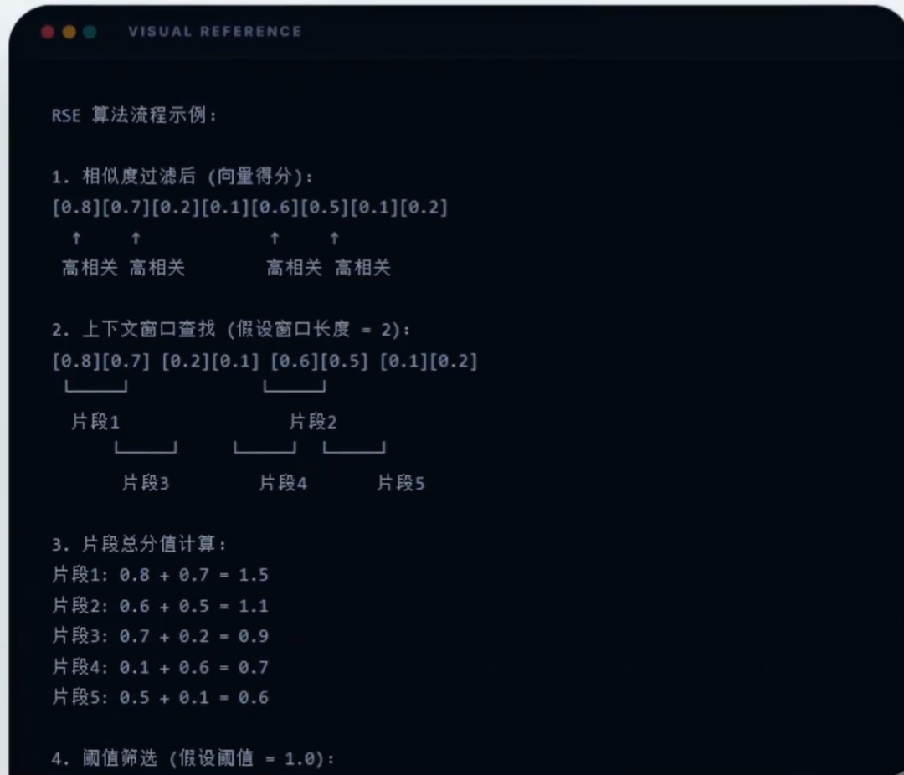
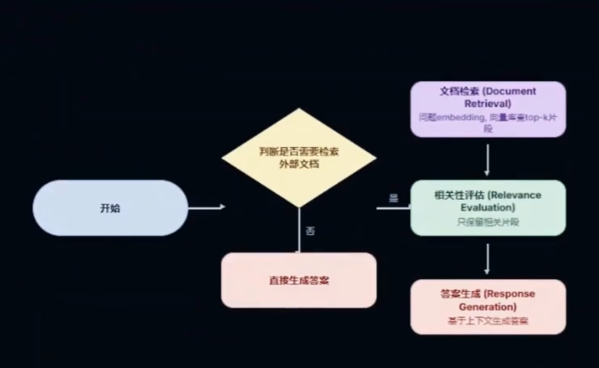
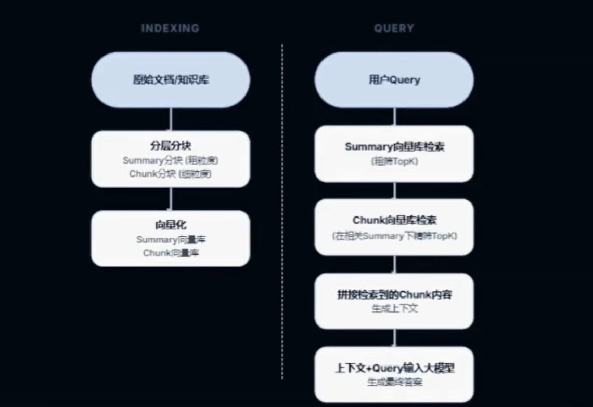
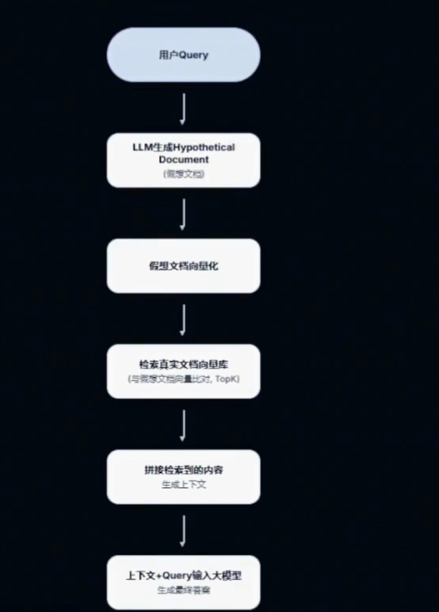
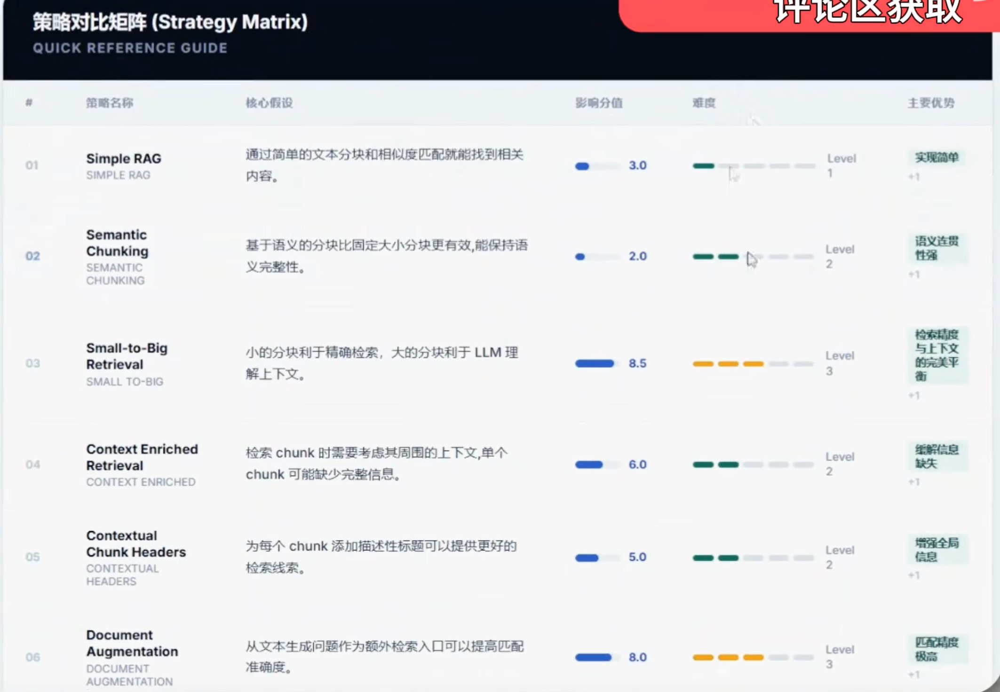

# 1.Simple RAG 简单的RAG
最基础的RAG方案，仅依靠Embedding模型将Query和Chunk转化为向量进行匹配

- 假设：通过简单的文本分块和相似度就能找到相关内容

- 实现逻辑：只需将文档进行固定长度切块（Fixed-length Chunking）然后存入向量数据库

- 主要优势：实现简单，几乎所有框架的基础

# 2.Semantic Chunking 语义切分
不在硬性规定chunk大小，而是计算相邻句子见的相识度，当相识度低于阈值时进行分断

- 假设：基于语义的分块比固定大小分块更有效，能保持语义完整性

- 实现逻辑：计算相邻句子间的语义相似度，并在相似度出现"断层"的地方chunk，确保每个chunk内语义高度一致

- 主要优势：语义连贯，减少断章取义

# 3.Small-to-Big Retrieve 
检索时匹配小的chunk，但在喂给模型时，自动替换为包含该小块的父文档或更大的chunk

Query -> Match Child Chunk -> Mapping -> Load Parent Chunk -> LLM

- 假设：小的分块利于检索，打的分块利于LLM理解上下文

- 实现逻辑：构建父子映射关系，子块（child）用于向量相识度计算，父块（parent）存储完整信息并作为Prompt输入

- 主要优势：检索精度与上下文的完美平衡，减少上下文断裂

# 4.Context Enriched Retrieval 上下文增强检索
检索到最相关的chunk后，自动带出其物理位置前后的 N 个chunk，补充上下文环境

Query -> Top-K Chunk -> [Pre-Chunk, Target-Chunk, Post-Chunk] ->LLM

- 假设：检索chunk时需要考虑其周围的上下文，单个chunk可能缺少完整信息

- 实现逻辑：检索到目标chunk后，将其物理索引的上一个和下一个chunk一并返回给模型

- 主要优势：缓解信息缺少，逻辑简单

# 5.Contextual Chunk Headers 上下文块标头
在分块时，将全文标题或章节摘要作为Header拼接在每个Chunk头部

- 假设：为每个Chunk添加描述性标题可以提供更好的检索线索

- 实现逻辑：对每个chunk计算其所属的上下文标题，存储时使用embedding(chunk)+embedding(head)/2 进行检索

- 主要优势：增强全局信息，利于embedding理解

# 6.Document Augmentation 文档增强
在检索阶段，让LLM针对每个chunk预生成几个可能得问题，检索时匹配这些预设问题

- 假设：从文本生成问题作为额外检索入口可以提高匹配准确度

- 实现逻辑：将生成的“假设问题”与原始Chunk关联，检索时，计算用户Query与这些问题的相似度，因为用户的问题通常比文档片段更接近LLM生成的问题

- 主要优势：匹配精确度极高，弥补语义鸿沟

# 7.Query Transformation 查询转换
包括如下重写方式
- 1、查询重写
- 2、回溯提示
- 3、子查询分解

- 假设： 用户的原始查询可能不是最优的检索形式，需要转换和扩展

- 实现逻辑：将用户查询改写

- 主要优势：适应多样化提问，处理复杂任务

# 8.Rerank 重排
通过向量匹配初筛出TOP K，再用高精度二分排位模型（Cross-Encoder）精挑TOP 5

- 假设：初筛结果需要二次排序以提高相关内容的排名

- 实现逻辑：相似不等于相关，使用LLM对每个候选文档进行相关性评分

- 主要优势：大幅度提高相关性，消除相似不相关

# 9.RSE（Relevant Segment Extraction) 相关性片段提取
检索连续】具有聚合相关性的片段，而不是孤立的向量TOP k

-假设：相关信息可能分布在连续的文本段落中，而不是离散的Chunk

- 实现逻辑：1：相似度过滤 -> 2:上下文窗口查找 -> 3:片段总分值计算 -> 4:阈值筛选

- 主要优势：信息完整、上下文感强

# 10.Contextual Compression 上下文压缩
获取更多的Chunk，然后压缩它，过滤只和Query相关的句子再给LLM

- 假设：检索的内容中包含无关信息，需要压缩提炼

- 实现逻辑：勇敢提示词让模型从长文档中脱水，仅保留核心干货

- 主要优势：检索Token浪费，减少背景干扰

# 11.Feedback Loop 反馈循环
记录用户交互和LLM反思，动态调整文档权重，实现检索自进化

- 假设：系统可以从用户反馈中学习，持续改进检索质量

- 实现逻辑：用户查询 -> 检索 -> 生成 -> 收集反馈 -> 存储并反思 -> 权重重标定

- 主要优势：系统自进化，用户偏好驱动，持续提升准确率

# 12. Self RAG
模型自我反思：是否需要检索？检索结果是否相关？ 生成内容是否由证据支撑

- 假设：模型可以过滤和问题相关的检索结果，减少噪声数据，用户相关性高的片段进行回答

- 实现逻辑：当一个用户问题过来时，先判断是否需要检索，如果不需要检索的话就直接回答，如果需要检索的话，去向量库中检索K个片段，对拿到的K个片段进行相关性评估

- 主要优势： 极其严谨，幻觉率极低

# 13.Knowledge Graph 知识图谱
构建实体与关系的图谱，跨节店检索关联信息

- 假设：信息之间存在关联关系，图结构可以更好地表达these关系

- 实现逻辑：从文档中抽取实体Entity和关系Relationship，在检索时，不仅根据向量搜索相关实体，还沿着关系边进行图搜索，挖掘跨章节，跨文档的隐形关联信息

- 主要优势：长链路推理能力、挖掘隐性关联

# 14.Hierarchical Indices 层次索引
先检索大块的Summary，锁定范围后，再在对应Summary下检索精细的Chunk

-假设：通过层次化的索引结构可以平衡检索的精确度和上下午

- 实现逻辑：系统通过两级向量库（Summary/Chunk)实现，Query先在粗粒度的Summary库中定位相关章节，再在these特定章节的细粒度Chunk库中进行精确检索

- 主要优势：大幅度缩短检索路径，平衡全局与局部

# 15.HyDE(Hypothetical Document Embedding)
先让LLM生成一个“假答案”，用假答案的向量去检索真文档

- 假设：生成假设性的答案文档可以帮助找到相关的内容，但有个致命缺陷，如果假设答案方向错误则检索时方向偏离

- 实现逻辑：HyDE通过让LLM基于Query生成一个假设性的回答文档，然后使用该假文档的向量在真实库中进行检索，这种方法能有效缓解用户Query与文档原文之间的语义鸿沟

- 主要优势：缓解冷启动检索问题，增强向量空间重合度

# 16.Fusion 混合检索
向量（语义）检索 + BM25（关键词）检索，通过RRF算法进行结果融合

- 假设：结合多种检索方法（如向量检索和关键词检索）可以互补优势

- 实现逻辑：融合召回A（向量）和召回B（关键词），向量检索找意思相近，关键词检索找精确命中

- 主要优势：几乎没有漏检，鲁棒性极强

# 17.CRAG（Correct RAG）
评估检索相关性，如果不佳则转而搜索web

- 假设：系统需要能够评估检索质量并在必要时寻找替代信息源

- 实现逻辑：CRAG 通过对检索的内容进行相关性评分（高、中、低），动态决定回答策略，高相关直接回答，中相关结合web补充，低相关则完全依赖web

- 主要优势：解决知识盲区，高可靠

