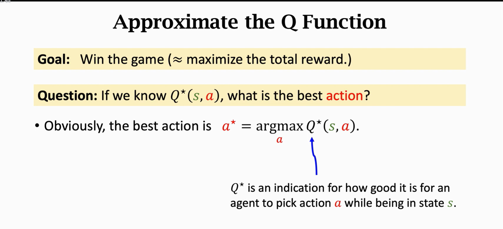
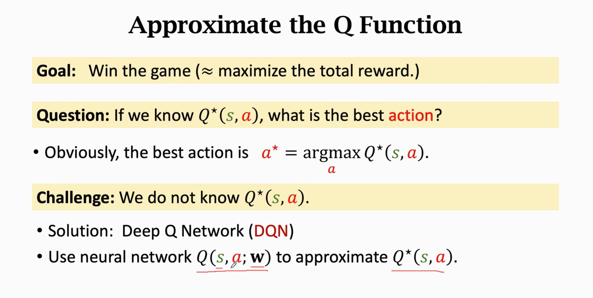
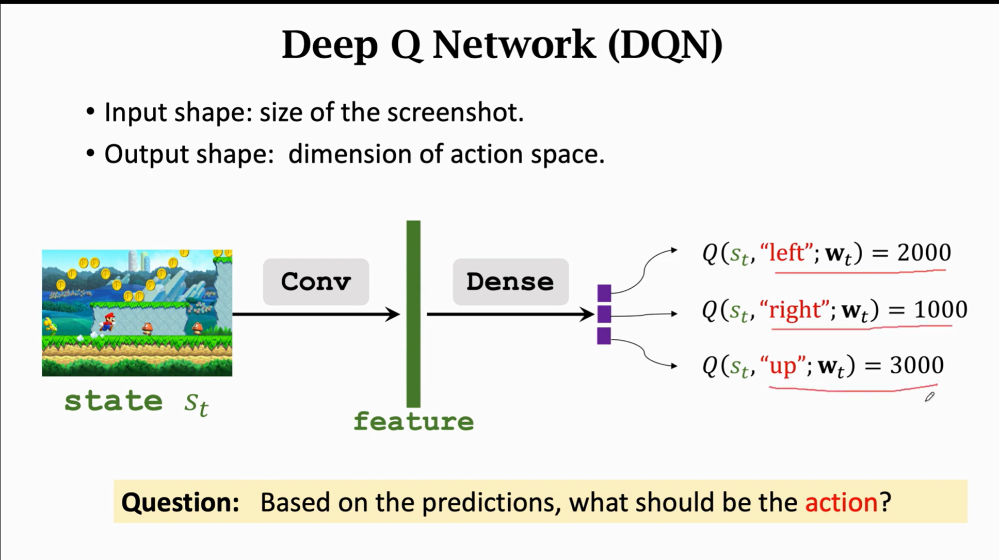

# 价值学习 Value-Based Reinforcement Learning





# How to apply TD learning to DQN

```shell
[TA --> TC] ~= [TA --> TB] + [TB --> TC]
    |             |              |
模型预测值       实测值         模型预测值


In deep reinforcement learning

Q(s_t,a_t; W) ~= r_t + γ * Q(s_t+1,a_t+1; W)

U_t = R_t + γ * U_t+1
   
```  

- DQN output Q(s_t,a_t,W), is estimate of E[U_t]
- DQN output Q(s_t+1,a_t+1,W), is estimate of E[U_t+1]
- Thus Q(s_t,a_t; W) ~= E[R_t + γ * Q(s_t+1,a_t+1; W)


