# 1、总纲-强化学习的目录图
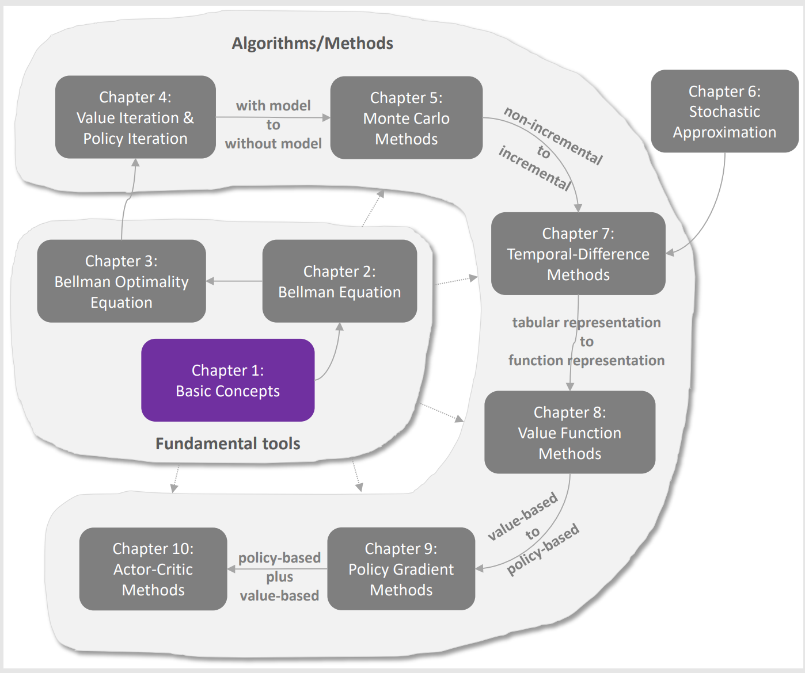

# 2、基础概念
- State 状态

State: The status of the agent with respect to the environment.

状态：智能体相对于环境的状态

- Action 行动

Action：for each State，there are can take of possible action

行动：对于每个状态，可以采取的可能动作

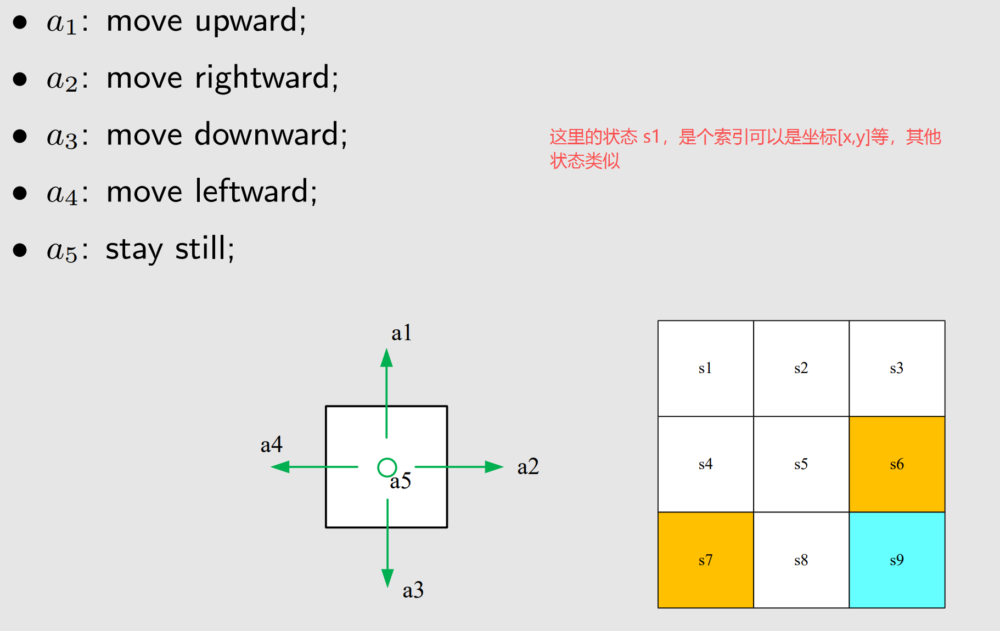

- State transition 状态转移

When taking an action, the agent may move from one state to another. Such a
process is called state transition

当采取行动时，Agent的从一个状态转移到另一个状态的过程，我们称之为状态转移

State transition describes the interaction with the environment

状态转移定义了与环境的交互

确定性表格
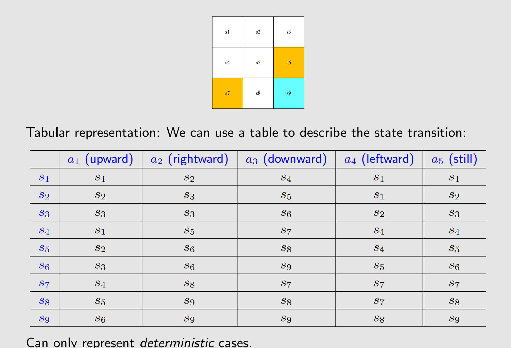

- State transition probability 状态转移概率

State transition probability: use probability to describe state transition!

状态转移概率：用概率来描述状态转移

状态转移概率既可以是确定性也可以是随机性
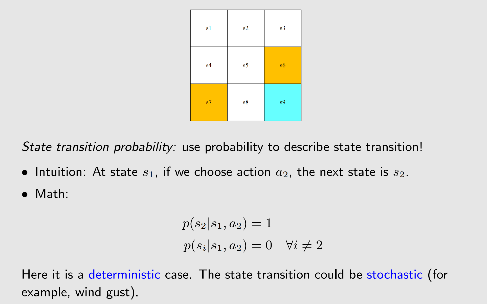

- Policy 策略

Policy tells the agent what actions to take at a state

策略可以告诉Agent在某个状态下采取的动作

确定性的
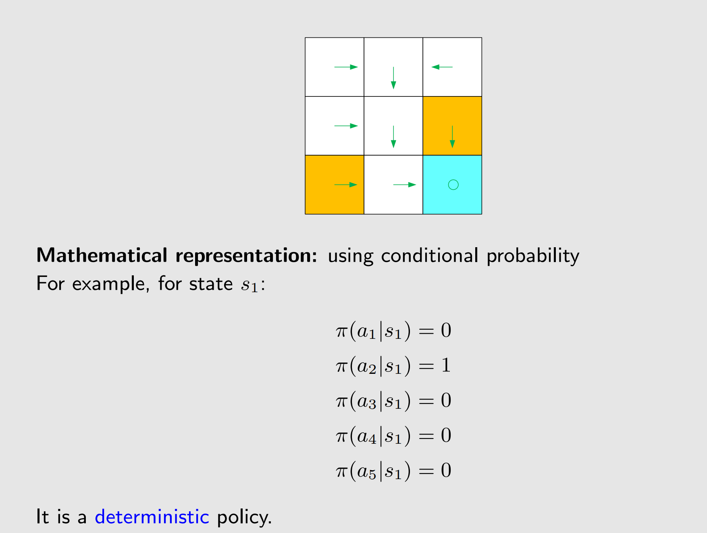

不确定性的
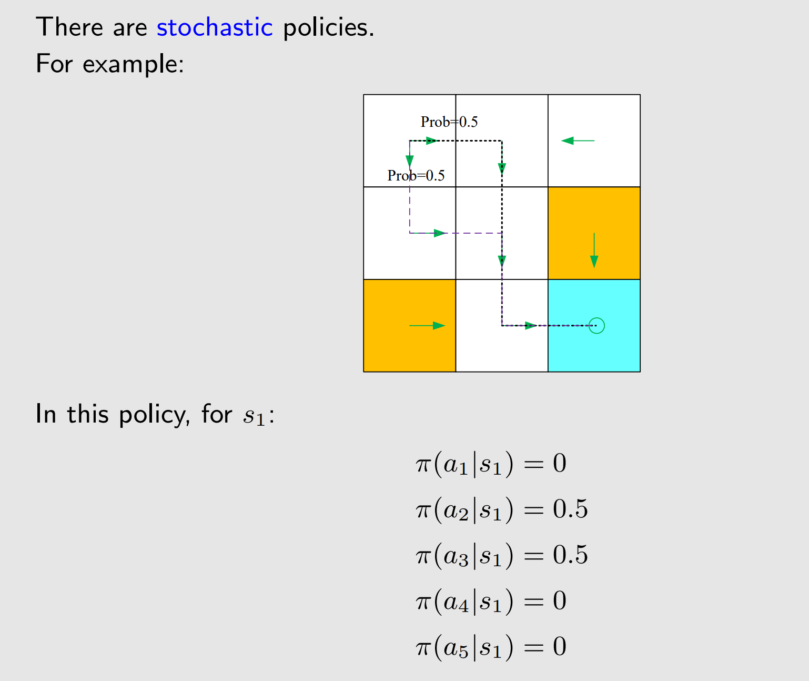

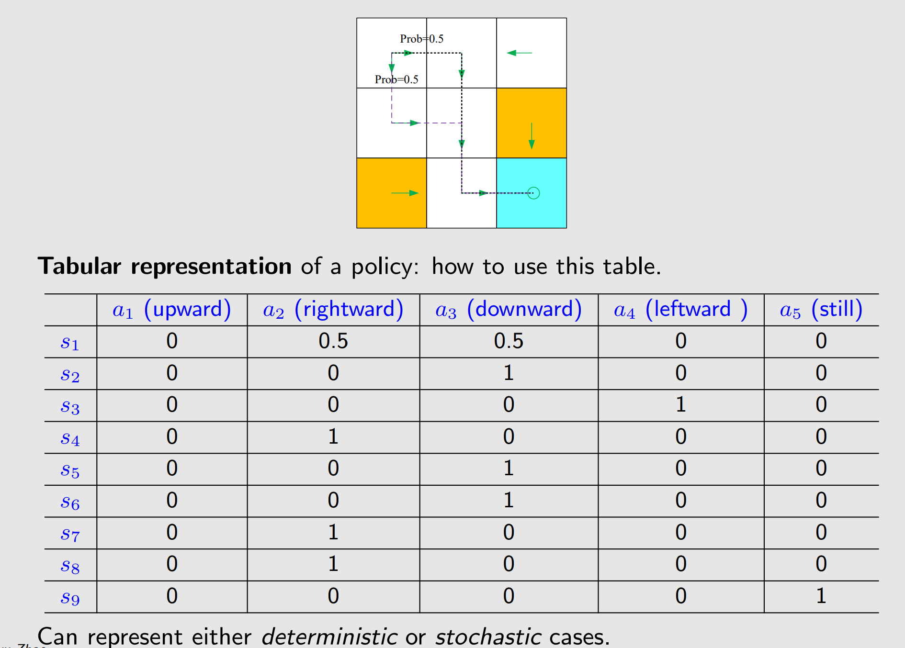

- Reward 奖励

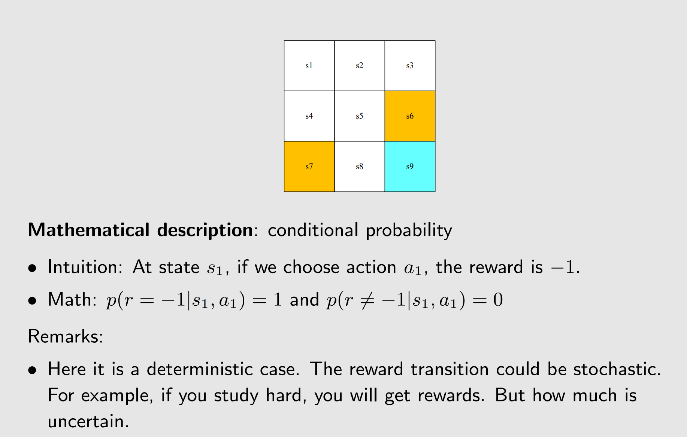

- Trajectory and return  轨迹和返回

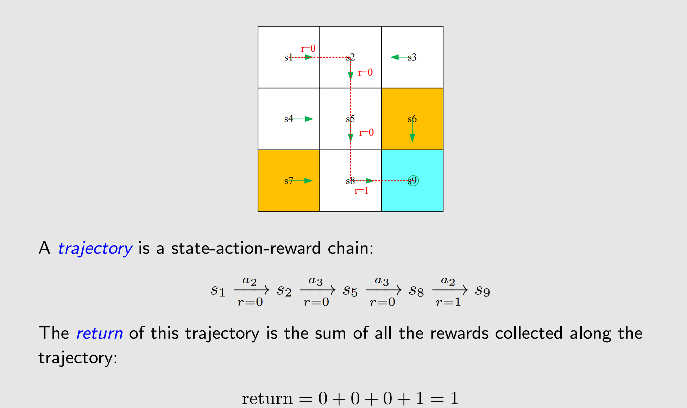

- discount Reward 折扣返回

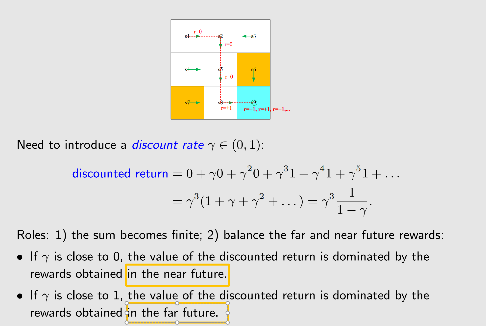

- Episode 集合、片段

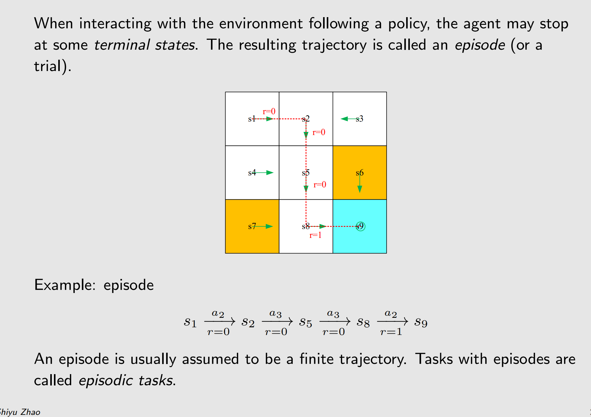

- Markov decision process (MDP) 马尔科夫决策过程
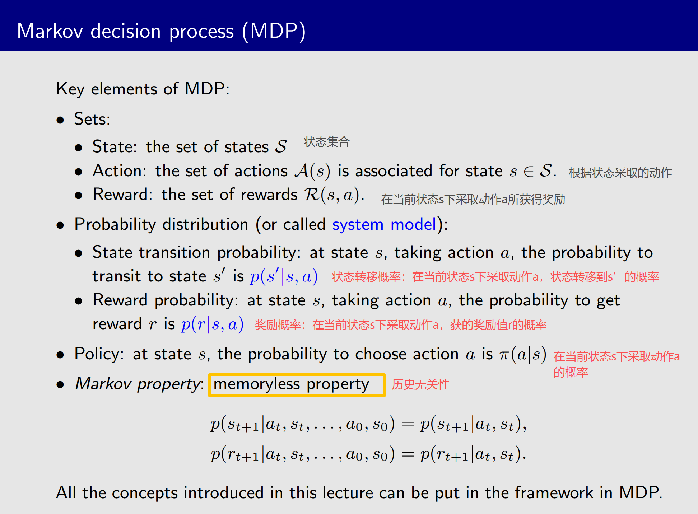
